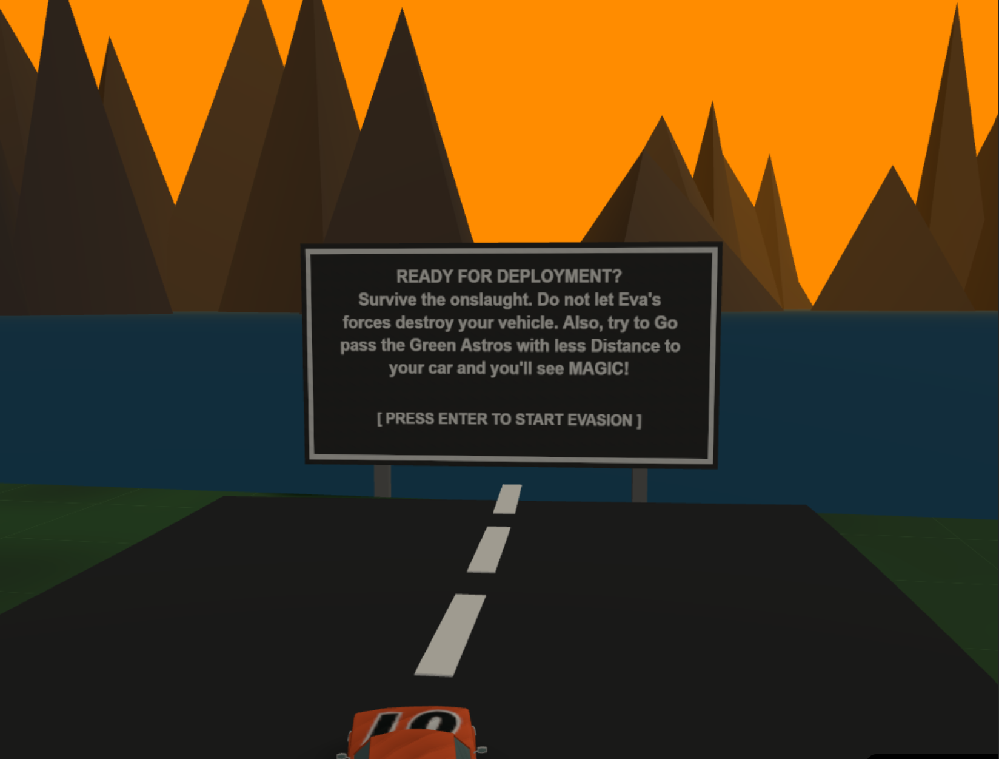
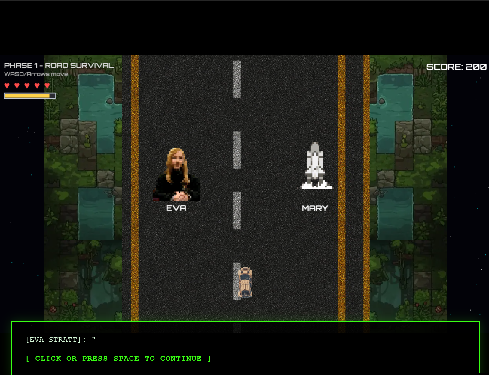
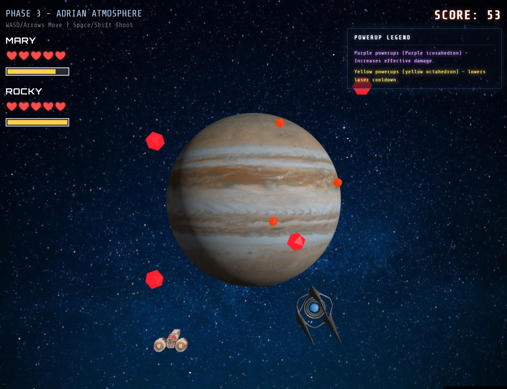
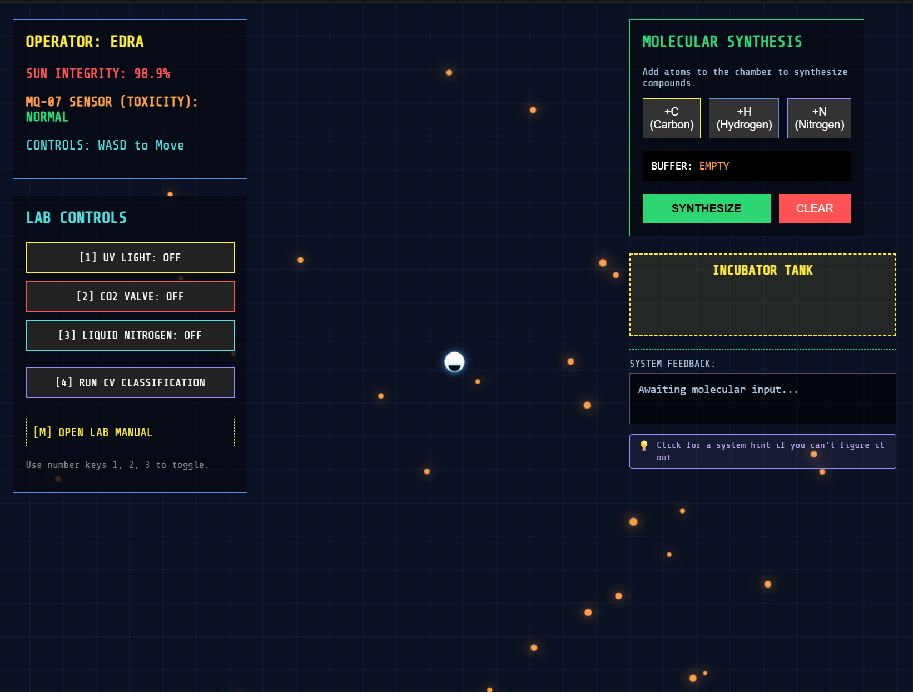

# Astrophage Survival

A browser sci-fi survival experience built around **Phaser 3** (2D arcade physics), JavaScript, and **Howler.js** for audio. The project mixes ground phases (vehicle gameplay), cinematic and conversation scenes, and space-action phases—all wired through `window.AG` shared state between scenes.

**Working title / boot theme:** Project Hail Mary–style terminal intro (see `index.html`).

---

## Screenshots


| | |
|:-:|:-:|
| **Phase-1** | **Phase-2** |
|  |  |

| | |
|:-:|:-:|
| **Phase-3** | **Phase-4** |
|  |  |


---

## How to run locally

There is **no build step**. Open **`index.html`** in a browser, or serve the folder with any static HTTP server so asset paths behave consistently:

```bash
# Example with Python 3
cd /path/to/ASTROPHAGE-SURVIVAL
python -m http.server 8080
# Then open http://localhost:8080
```

 Scene scripts live under **`js/`**; asset catalog in **`assets/index.json`**.

---

## Tech stack

- [Phaser 3](https://phaser.io/) (Arcade Physics, scenes)
- Vanilla JavaScript — no npm / bundler for the main Phaser flow
- [Howler.js](https://howlerjs.com/) for audio

---

## Repository layout (short)

| Path | Role |
|------|------|
| `index.html` | Game entry |
| `js/` | Scene code (`SceneGym`, `SceneMenu`, phases, HUD patterns, etc.) |
| `js/globals.js` | Shared **`window.AG`** state |
| `assets/` | Art, sounds, **`index.json`** manifest |

---


